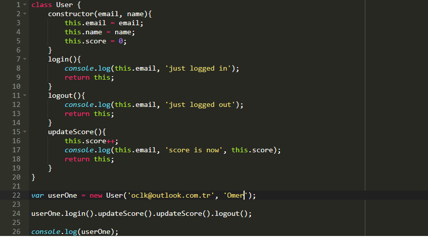
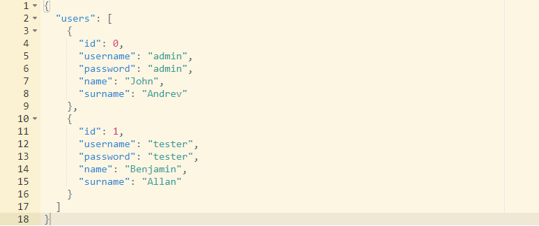
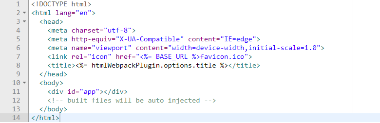

# vue-codeditor

Multi-language vue js code editor component running on the browser.

### Project setup
```
npm install vue-codeditor
```

### Usage
##### Import vue-codeditor component
```
// main.js

import Vue from 'vue'
import App from './App.vue'
import vueCodeditor from "vue-codeditor/vue-codeditor.js";

Vue.component(vueCodeditor)
```
##### Usage in other components
```html
<!-- App.vue -->

<template>
  <div id="app">
    <!-- 
        * Can be used in the loop (for multiple editor components)
        * Id must be unique for each vue-codedit component
        * Each component must have its own content value.
    -->
    <vue-codeditor id="id" mode="javascript" theme="monokai" :content="content" @changeContent="changeContent" />
  </div>
</template>

<script>
export default {
  name: "App",
  data() {
    return {
      content: "console.log('Hello world!')",
    };
  },
  methods: {
    changeContent(val) {
      if (this.content !== val) {
        this.content = val;
      }
    },
  },
};
</script>
```

### Sample pictures








#### Contributing
Pull requests are welcome. For major changes, please open an issue first to discuss what you would like to change.

Please make sure to update tests as appropriate.

#### License
[MIT](https://choosealicense.com/licenses/mit/)